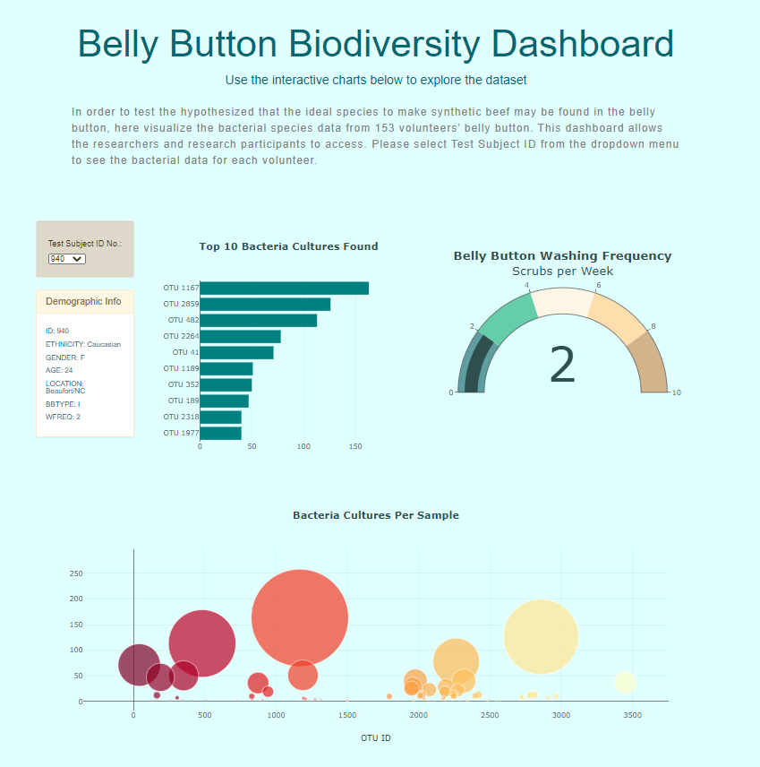
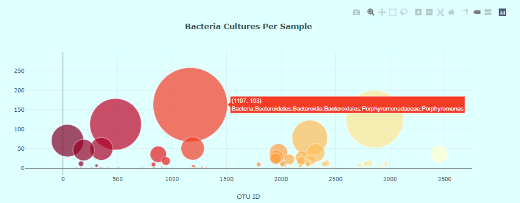

# Plotly_Bacteria

## Project Overview
Visualize the bacterial species data from 153 volunteers’ belly button in order to test the hypothesized that the ideal species to make synthetic beef may be found in the belly button. Create a dashboard allowing the researchers and research participants to access.
## Results

###### Dashboard

###### Bubble Chart

